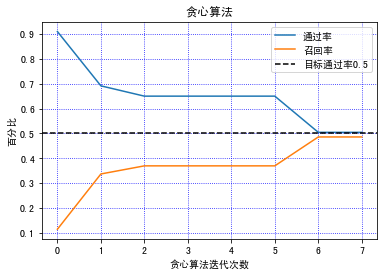
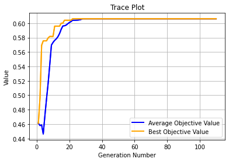

# 问题设定:
1.给定业务目标通过率的情况下，寻求变量最优阈值，使得召回率最大（即提升资产水平）；<br />

2.假设单条规则均为强拒绝规则构成：;<br />
```sql
近3个月信用卡审批查询次数>5
```

3.最终的规则集由多条强拒绝规则以逻辑或的关系构成：<br />
```sql
近3个月信用卡审批查询次数>5 or 
近2年贷款次数>2 or
近1年最高授信额度<2000
```

# 解决方案:
## 1.贪心算法

```sql
1.从第一个变量开始，第一个变量通过率98%，然后依次降低到95%，如果是10个变量，则截止第二个变量的整体通过率为98%-(98%-95%)/10
2.第k+1次迭代: 固定前k次的规则组合预测结果，优化目标是通过加入第k+1个变量，降低当前通过率，使得整体召回率最大

->贪心本质：先调对策略结果可能影响最大的变量，只顾当下最优，不顾全局最优
->效率：从指数级别的算法复杂度降低到线性级别
->操作简单：可以把业务上不建议调的规则前置，然后执行贪心算法
```
**代码演示**:<br />
example/greedy_strategy_example.ipynb

## 2.遗传算法

```sql
遗传算法是模拟达尔文生物进化论的自然选择和遗传学机理的生物进化过程的计算模型，是一种通过模拟自然进化过程搜索最优解的方法。

->适用范围：目标函数难以定义解析表达式的问题
->效率：会随着初始种群数量的增加而变慢
->收敛：适具体问题，收敛可能较慢，且是否达到最优解难以判断
```
**References**:<br />
http://geatpy.com/index.php/quickstart

**代码演示**:<br />
example/genetic_algorithm_example.ipynb
